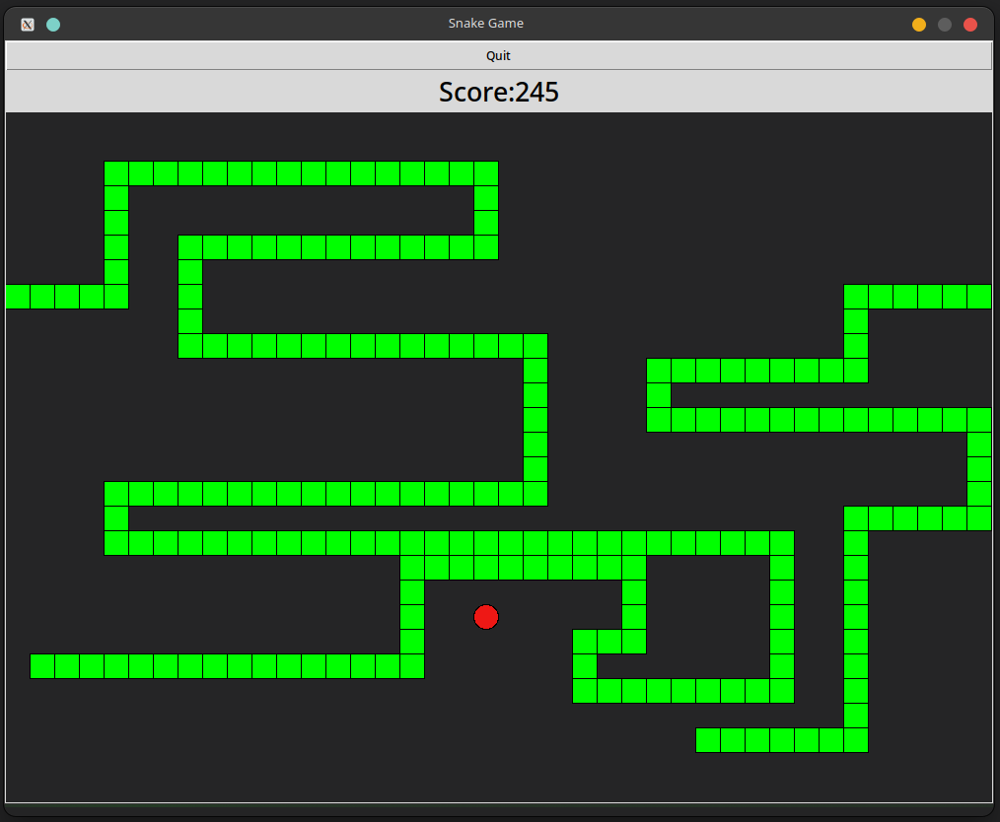

# Snake Game

This is a classic Snake game implemented in Python.

<div style="text-align:center">
    
</div>

## Installation

1. Clone this repository to your local machine:

    ```bash
    git clone https://github.com/Wayfarerdesert/snake_v2.git
    ```

2. Navigate to the project directory:

    ```bash
    cd snake-game
    ```

3. Create and activate a Python virtual environment using pip:

    ```bash
    python3 -m venv venv
    source venv/bin/activate
    ```

## Usage

1. Ensure you're in the project directory and your virtual environment is activated (you should see `(snakeEnv)` in your terminal prompt).

2. Run the snake game script:

    ```bash
    python main.py
    ```

3. **Controls**:
   - Use the UP key to move the snake up.
   - Use the LEFT key to move the snake left.
   - Use the DOWN key to move the snake down.
   - Use the RIGHT key to move the snake right.

4. Try to eat as much food as possible to increase your score and avoid collisions with the walls or the snake's own body.

5. Press `Q` or press the exit button to quit the game.

## Deactivating the Virtual Environment

Once you're done playing, you can deactivate the virtual environment using the following command:
```bash
deactivate
